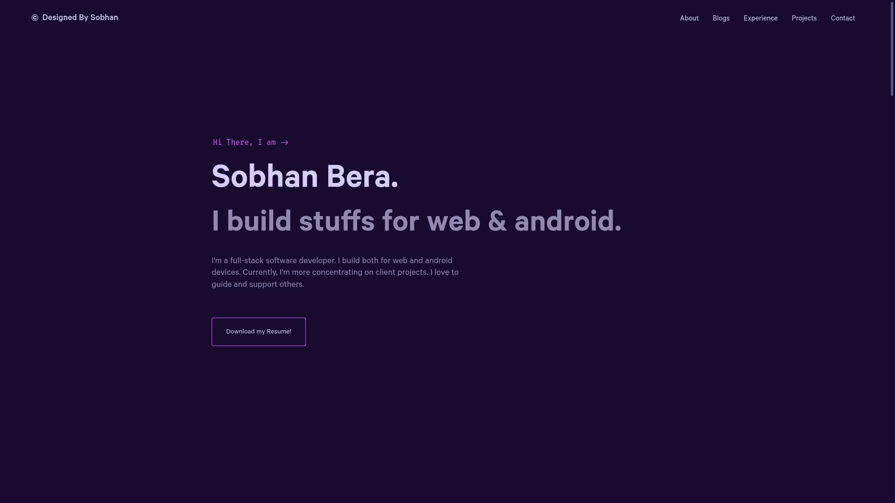
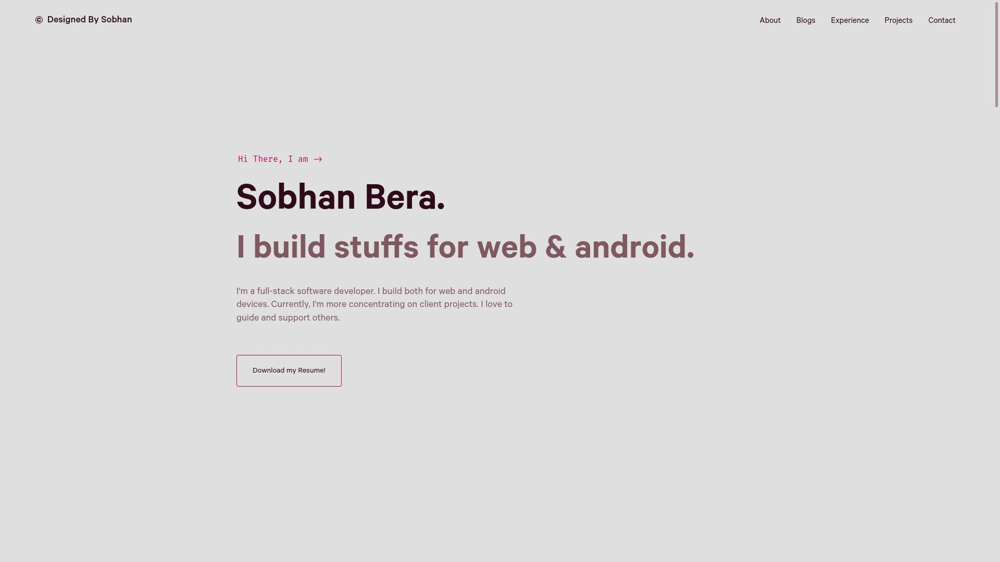

<h1 align="center">
  sobhanbera - v2
</h1>

<p align="center">
  This is the 2nd version of my portfolio build with <a href="https://nextjs.org" target="_blank">Next.JS</a> and hosted in <a href='https://vercel.com' target="_blank">Vercel</a>.
</p>

<p align="center">
  <a href="https://sobhabera.github.io" target="_blank">
    
  </a>
  <a href="https://sobhabera.github.io" target="_blank">
    
  </a>
</p>

## Getting Started

Install all packages:

```
yarn install
```

First, run the development server:

```bash
npm run start
# or
yarn start
```

Open [http://localhost:3000](http://localhost:3000) with your browser to see the result.

# Setup Firebase configurations

1. Create a project on firebase.
2. Follow this [link](https://firebase.google.com/docs/database/web/start) to create a new application and get it's configurations.
3. Get all the configuration in this file - `/firebase/index.ts`
4. Follow the `template.ts` file to create `index.ts`
4. You are done with firebase now.

## Deploy on Vercel

The easiest way to deploy your Next.js app is to use the [Vercel Platform](https://vercel.com/new?utm_medium=default-template&filter=next.js&utm_source=create-next-app&utm_campaign=create-next-app-readme) from the creators of Next.js.

Check out our [Next.js deployment documentation](https://nextjs.org/docs/deployment) for more details.
